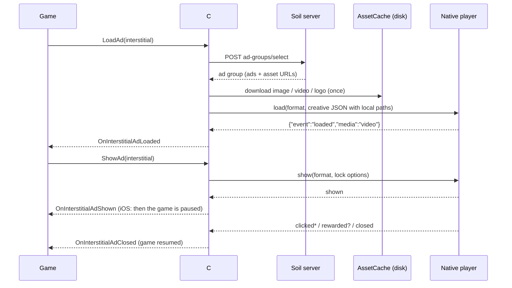

# Native ad players: the full picture

A maintainer's overview of the migration from Unity-drawn ads to native players: what changed, how
it works end to end, what it is built with, how it is tested, and where to look when something
breaks. The exact contract between C# and the players is in
[`NativeAds/PROTOCOL.md`](../../NativeAds/PROTOCOL.md); the game-facing API is in
[`Integration.md`](Integration.md); the trade-offs against the old model are in
[`NativePlayersComparison.md`](NativePlayersComparison.md).

## What was done

| Before | After |
|---|---|
| Banner, interstitial and rewarded ads were Unity prefabs: a Canvas, `VideoPlayer` into a `RenderTexture`, TMP + RTLTMPro text, a blocker canvas for input | One small **native player per platform** draws them: Android views and an Activity, iOS UIKit and `AVPlayer`. The prefabs, `AdDisplayComponent`, placement classes and TMP font helpers are gone |
| The game kept running under the ad (sound, timers, physics) | The game is **paused** while a fullscreen ad is up, like with AdMob |
| Videos streamed from their URL on every play | Every file is **downloaded once and cached**; the players only play local files |
| — | The `native` format is unchanged: the SDK hands the game the content (texts + textures), and the game draws it in its own UI |

The public C# API (`Advertisement.LoadAd / IsFormatReady / ShowAd / HideAd`, the `Events.On…`
events, the rewarded cooldown, the lock times) stayed the same, so games only had to update the SDK.

## How it fits together

**C# owns decisions; the players own presentation.** C# picks the ad, downloads and caches its
files, applies cooldowns and frequency rules, runs watchdogs and raises the public events. The
players never touch the network: they decode local files, draw the ad, count the time it is
visible, and send events back as one-line JSON.

### C# side (`Assets/FlyingAcorn/Soil/Advertisement`)

| Piece | Job |
|---|---|
| `Advertisement.cs` | Public API; fetches ad groups (`UnityWebRequest` + `Newtonsoft.Json`), drives slots, raises `Events` |
| `Data/AssetCache.cs` | Downloads and caches assets under the app's persistent data (`SoilAssets/`), keyed by ad and asset id; reuses, retries, repairs, prunes unused files; excluded from iCloud backup on iOS |
| `Logic/AdSlot.cs` | Per-format state machine: loading, ready, showing, cooling down. Watchdogs: 60 s to prepare, 30 s for the player to answer a show, so a slot can never get stuck |
| `Logic/AdCreative.cs`, `NativeAdProtocol.cs` | Builds the creative JSON sent to the player; parses the player's events |
| `Logic/FullscreenLockPolicy.cs` | Close-button lock: interstitial 5 s, or 80% of the video with a 5 s minimum, and always closable by 15 s (Google Play's rule); rewarded 20 s, or the whole video. Shared rule, re-implemented and unit-tested on every platform |
| `Logic/AdLinkPolicy.cs` | Which click links may open: web and store links always; on Android other app links too, except ones that act on the device (`intent:`, `file:`, `tel:`…) |
| `Player/AndroidAdPlayer.cs`, `IosAdPlayer.cs` | Thin bridges: `AndroidJavaClass` calls into Java; `[DllImport("__Internal")]` calls into Objective-C |
| `Player/SoilAdsNativeReceiver.cs` | The GameObject that receives `UnitySendMessage` events from both players |
| `Player/EditorAdPlayer.cs` | In the Editor, an IMGUI placeholder that follows the same rules (lock times, events), so game flows can be tested without a device. IMGUI cannot join Persian letters, so it shows English stand-ins for Persian texts |
| `Editor/SoilAdsProguardRules.cs` | Adds `-keep class com.flyingacorn.soil.ads.** { *; }` to Unity's `proguard-unity.txt`, so R8 never strips the Android player |

### The players

Both are shipped as **source**, so each game compiles them in its own build: nothing is downloaded,
and there are no binaries or dependency managers. Both use **only the operating system**.

| | Android (`Plugins/Android/SoilAds.androidlib`) | iOS (`Plugins/iOS/SoilAds`) |
|---|---|---|
| Language | Java 8, `android.*` only (no AndroidX, Play services or Kotlin) | Objective-C under ARC, strict C11 (Unity's Xcode flags) |
| Video | `MediaPlayer` on a `TextureView` | `AVPlayer` + `AVPlayerLayer` |
| Images | `BitmapFactory`, downsampled to the screen | ImageIO, downsampled to the screen |
| Video check at load | `MediaMetadataRetriever` (duration + one decoded frame) | `AVURLAsset` (playable, has a video track, duration) |
| JSON | `org.json` (part of Android) | `NSJSONSerialization` |
| Banner | A view added on Unity's activity with `addContentView` | A subview of Unity's root view controller's view |
| Fullscreen | `SoilAdActivity` (own Activity) | A modal `UIViewController` presented from Unity's root view controller |
| Pausing the game | Automatic: Unity's activity pauses under the ad activity | `UnityPause(1)` once C# has received `shown` (or after 0.5 s), `UnityPause(0)` on close |
| Opening a click | `Intent.ACTION_VIEW` + `CATEGORY_BROWSABLE` | `UIApplication openURL:` (http, https, itms-apps only) |
| Events to C# | `UnityPlayer.UnitySendMessage`, called through reflection | `UnitySendMessage` |
| Main files | `SoilAdsBridge` (entry points), `SoilAdsManager` (slots, events), `MediaLoader`, `SoilAdActivity`, `BannerView`, `LockPolicy`, `Backdrop`, `Ui` | `SoilAdsUnityBridge.m` (C functions), `SoilAdsManager`, `SoilAdsMediaLoader`, `SoilAdsFullscreenViewController`, `SoilAdsBannerView`, `SoilAdsLockPolicy`, `SoilAdsUI` |

### Life of one ad inside a player

1. **Load.** The player gets the creative JSON (local paths + texts). On a background thread it
   checks that the video really decodes, decodes the image and logo at screen size, and makes the
   small blurred backdrop. It then fills the format's **slot** and sends `loaded` with
   `media: video | image | text`. A broken video with a good image falls back to the image.
2. **Show.** A banner attaches at the bottom, top or center of the safe area. A fullscreen ad opens its
   own screen and sends `shown`. The slot is consumed, so the next ad must be loaded.
3. **On screen.** A timer counts only the time the ad is visible: it stops in the background and
   after a click. The close button shows the countdown until the lock policy unlocks it. A rewarded
   ad grants `rewarded` at that moment. The video pauses and resumes with the app, and keeps its
   position.
4. **Close.** The close button (or Android's back button, once unlocked) ends the show: exactly one
   `closed` per `shown`, after any `rewarded`. The game is resumed.

C# then raises the matching public events, starts the rewarded cooldown and loads the next ad.

### What the ads look like

- **Fullscreen:** the video or image fits the screen over a blurred, darkened copy of the image, so
  there are no black bars. The `تبلیغ` badge is top-left, and the countdown/close button is
  top-right; video ads also get a mute button. Below the media is an info card with the logo,
  title, description and a full-width call-to-action button. Parts the ad doesn't have are left
  out, and an ad without call-to-action text has no button. A Persian ad mirrors the layout (logo
  on the right), and every text line aligns to its own language.
- **Banner:** the standard size (full safe-area width × 50, or 90 on tablets). An image banner
  shows the image centered with a blurred fill at the sides and the badge on its corner. A banner
  without an image shows the logo, the badge before the title, the description and a button.
- Fonts are the system's. Nothing is bundled.

## Testing

| Layer | Where | How to run |
|---|---|---|
| C# logic (lock policy, slots, cache plan, links, creative building) | `NativeAds/logic-tests` | `dotnet test` (~200 tests, no Unity needed) |
| C# in Unity | `Assets/FlyingAcorn/Soil/Advertisement/Tests`, `Editor/Tests` | Unity Test Runner |
| Android player, JVM | `NativeAds/android/src/test` | `./gradlew --offline testDebugUnitTest` |
| Android player, on device | `NativeAds/android/src/androidTest` (real Activity, MediaPlayer, banner, back button, recreation) | `./run-device-tests.sh` with an emulator running |
| iOS player | `NativeAds/ios` harness app + XCTest (real UIWindow, AVPlayer, the C bridge against Unity stubs) | `xcodebuild test` on a simulator; see its README |
| End to end in a Unity build | `NativeAds/unity-e2e` (the real Unity bridge and players, local test media, minified on Android) | `run.sh android` / `run.sh ios` |

**Previewing a design.** Both harnesses can show any ad without a game. On iOS, launch the harness
app with `SOILADS_PREVIEW_FORMAT` and `SOILADS_PREVIEW_CREATIVE` (see `HostApp/main.m`). On
Android, run `SoilAdsPreviewTest` with `previewFormat` and `previewCreative` (see the class comment).
The screenshots above were made this way, from real cached Soil creatives.

## Debugging in a game

- Android: `adb logcat | grep -E "SoilAds|Ad Event received"`. The player logs under the `SoilAds`
  tag; C# logs its events through the game's logger.
- iOS: player lines start with `[SoilAds]` in the device console (Xcode, or
  `xcrun devicectl device process launch --console …`).
- `[Advertisement] Android ad player unavailable` / `iOS ad player unavailable` in the Unity log
  means the plugin folder was left out of the build.
- Every player event is one JSON line, e.g. `{"format":"rewarded","event":"rewarded"}`, so a log
  shows the exact order the game received.

## Rules to keep when changing the players

- **No dependencies and no network** in native code. The players must build in any game, from any
  country, through any store.
- **iOS binary hygiene:** no symbol, string or file name that names a country, a regional store,
  an ad network or a domain.
- **iOS sources must compile under strict C11:** no `?:` shorthand and no `typeof`. Guard any API
  newer than iOS 12 with `@available`. The harness builds with warnings as errors to catch this.
- **Android:** stay on Java 8 and `android.*`, and check every API against minSdk 22.
- **Nothing may throw out of a player.** Run every new callback the OS makes into the player
  through the guard (Android `Guard`, iOS `SoilAdsGuard`); a failure ends the show cleanly instead
  of ending the game. The device tests inject a fault (`failAtForTests`) to prove it.
- **Behavior lives in `PROTOCOL.md`.** Change it there first, then on both platforms, then the
  tests on both.
- Keep Android and iOS looking and behaving the same. The comparison screenshots are the easiest
  check.

## Known limitations

- On Android, every fullscreen ad sends the game `OnApplicationPause(true/false)`, because Unity's
  activity really pauses.
- On iOS, a game paused under an ad doesn't receive `OnApplicationPause` if the app is
  backgrounded during the ad. Ad sound follows the silent switch.
- The game receives `clicked`, `rewarded` and `closed` only when the ad closes, because the game
  is paused while the ad is up.
- Desktop, WebGL and consoles have no player, so there is no fill there for banner, interstitial
  or rewarded ads.
- The look is fixed in native code. Games can't restyle these formats; the `native` format exists
  for that.
